# Evac Zone for ATAK — User Guide

**Version 0.4 · takwerx**

**Download Evac Zone 0.4** (pick the one matching your ATAK-CIV version, sideload, then load it in ATAK's Plugins manager):

- **ATAK-CIV 5.6:** https://github.com/takwerx/evac-zone/releases/download/v0.4/ATAK-Plugin-EvacZone-0.4--5.6.0-civ-release.apk
- **ATAK-CIV 5.7:** https://github.com/takwerx/evac-zone/releases/download/v0.4/ATAK-Plugin-EvacZone-0.4--5.7.0-civ-release.apk
- **ATAK-CIV 5.8:** https://github.com/takwerx/evac-zone/releases/download/v0.4/ATAK-Plugin-EvacZone-0.4--5.8.0-civ-release.apk

All releases: https://github.com/takwerx/evac-zone/releases

Evac Zone draws evacuation zones on the ATAK map from the agencies that publish
them, colored by what their status means, and lets you find a zone by name and
go to it.

---

## Before you start

- Published builds exist for ATAK-CIV 5.6, 5.7 and 5.8. Install the one that
  matches your ATAK.
- The plugin needs internet access to fetch zones. Once a state has been
  fetched it keeps drawing without a connection and tells you how old it is.
- Nothing is sent from your phone: no location, no callsign.
- Built and tested in California. Other states are there where public data
  was found: Oregon, British Columbia, and hurricane zones for two Florida
  counties (lettered A to E, no live status; the county calls zones by letter).
  If your state publishes evacuation zones and they are not here, point us at
  the data: https://github.com/takwerx/evac-zone/issues

## 1. Open it

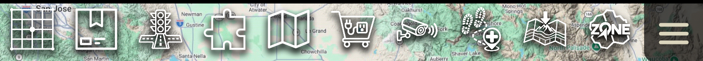

Tap the ZONE badge on the toolbar. Tap it again to close the pane.

## 2. The top row

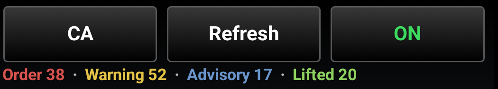

- The **state** button picks the state or province.
- **Refresh** fetches now. Live states refresh on their own every five minutes.
- **ON / OFF** is the map's switch. OFF takes every zone off the map and
  remembers what you had on; ON puts it back.

Under the buttons, the counts of what is on the map: Order, Warning, Advisory,
Lifted. These follow whatever you narrow to below.

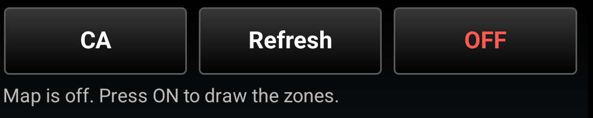

## 3. Pick a state

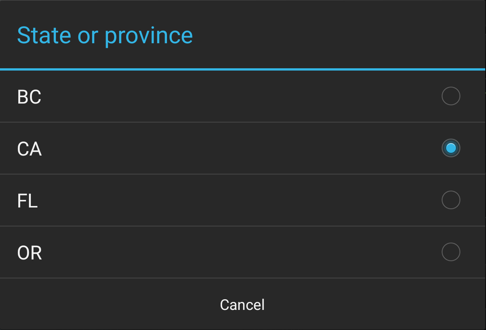

Just the states. Pick one and the pane shows that state's feed and counties.

## 4. The state's feed

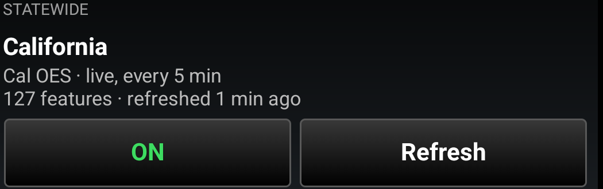

One row per state. **ON** loads it and draws it; the row then shows how many
zones it holds and how long ago it refreshed. **Refresh** fetches now.

California is Cal OES's orders and warnings with CAL FIRE's reason, population
and lifted zones and the county feeds folded in, one zone drawn once. Oregon is
OEM's levels: 1 Be Ready, 2 Be Set, 3 Go Now. British Columbia is its orders
and alerts.

## 5. Counties

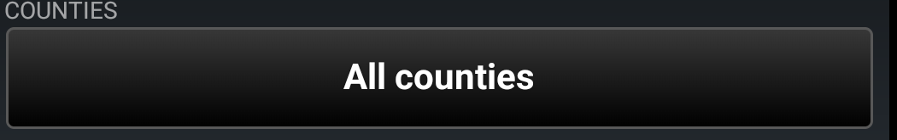

**All counties** is the whole state. Tap it to narrow:

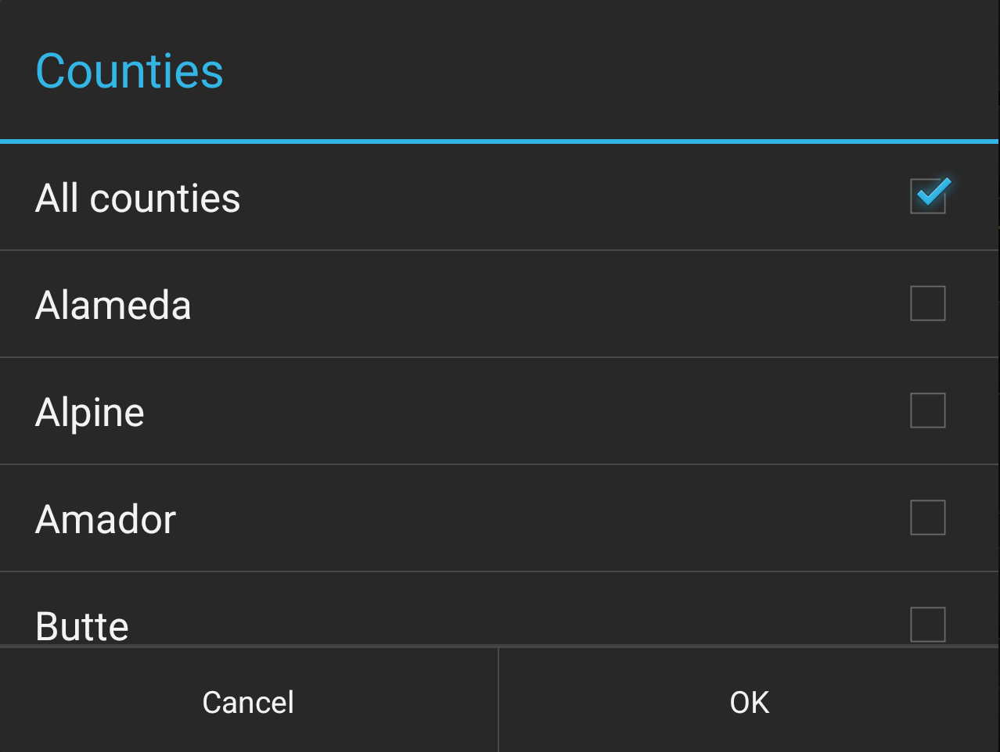

Every county is listed. The number beside a county is how many zones the state
feed has there right now; no number means nothing is happening there.

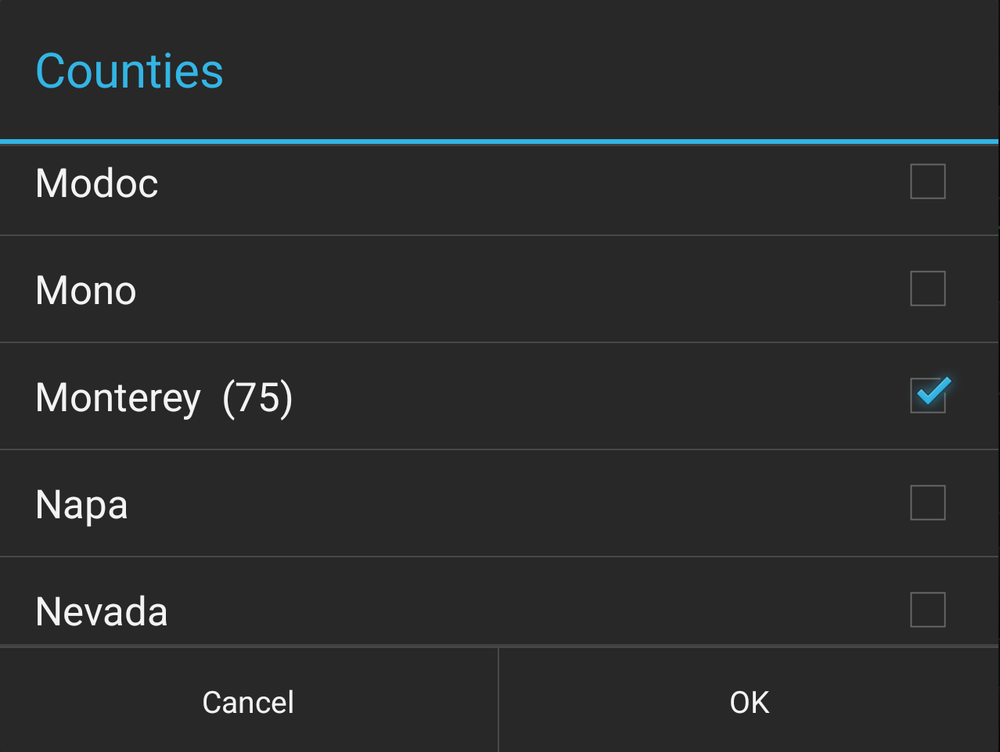

Tick one or many and press OK. The map, the list and the counts narrow to those
counties. Tick **All counties** to clear it.

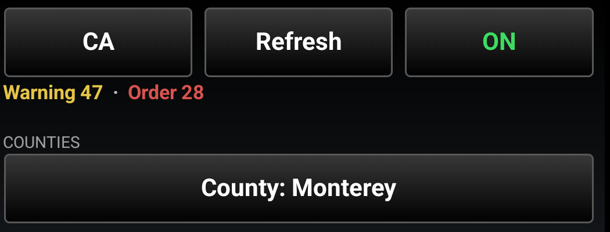

## 6. Reading the map

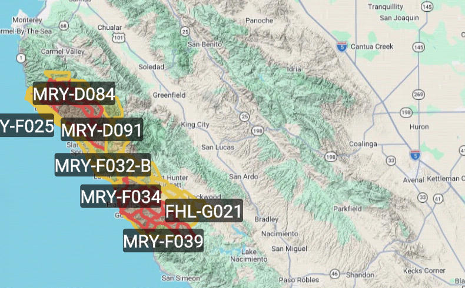

One color language, whatever a county calls it:

| Color | Meaning |
|---|---|
| Red | Evacuation Order, Level 3 Go Now, Mandatory |
| Yellow | Evacuation Warning, Level 2 Be Set, Voluntary, Alert |
| Blue | Advisory, Level 1 Be Ready |
| Purple | Shelter in Place |
| Green | Lifted, Cancelled, All Clear, Repopulation |
| Faint | Normal, no evacuation |
| White | A status the plugin does not know |

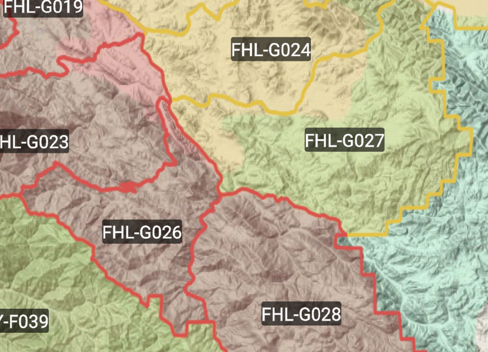

Each zone carries its name at its center, the short way the agencies say it:
FHL-G026, not the full US-CA-XMY-FHL-G026. The full id is in the details.

## 7. A zone's details

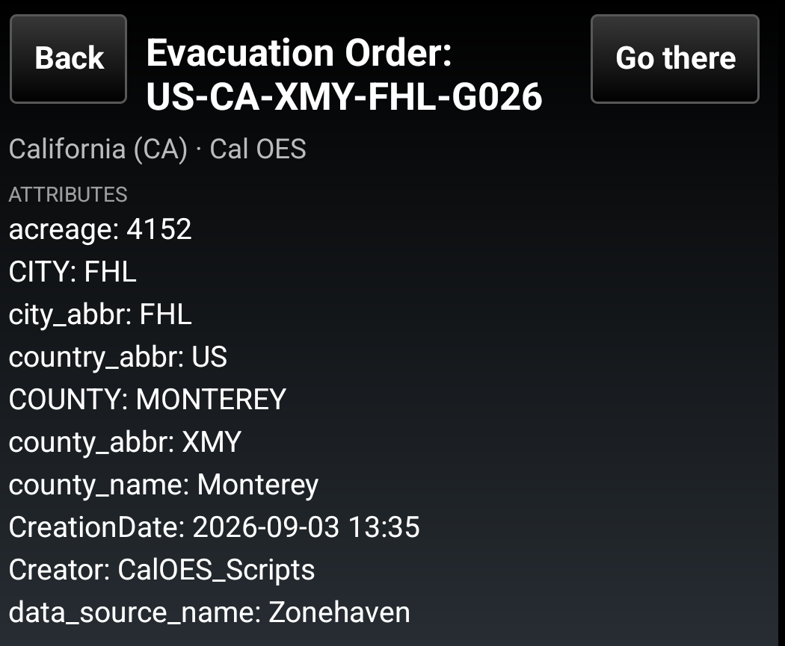

Tap a zone on the map, or **Details** on a row in the list. You get the status
and the id, which agency it came from, and every attribute the agency
publishes. **Go there** frames the zone on the map and keeps the details open.
**Back** closes them.

## 8. Distance from a point

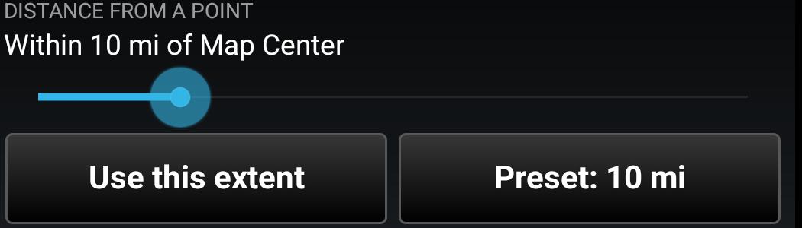

Limit what is drawn to a radius around the map center or around you, in your
ATAK units. Slide it, or **Use this extent** to take what you are looking at as
the radius. All the way left is off, the whole state.

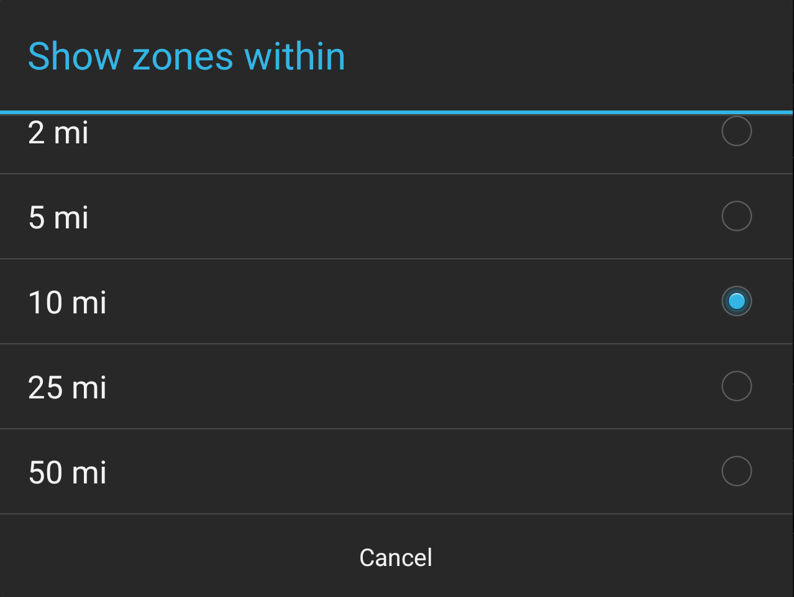

Which point it measures from is the **Nearest to** choice down by the list.

## 9. Draw on the map

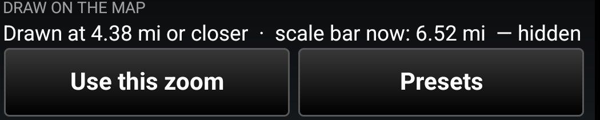

Hold the zones until you are zoomed in past a threshold. **Use this zoom** takes
the scale you are looking at. The readout quotes ATAK's own scale bar and says
**hidden** when the map is outside it.

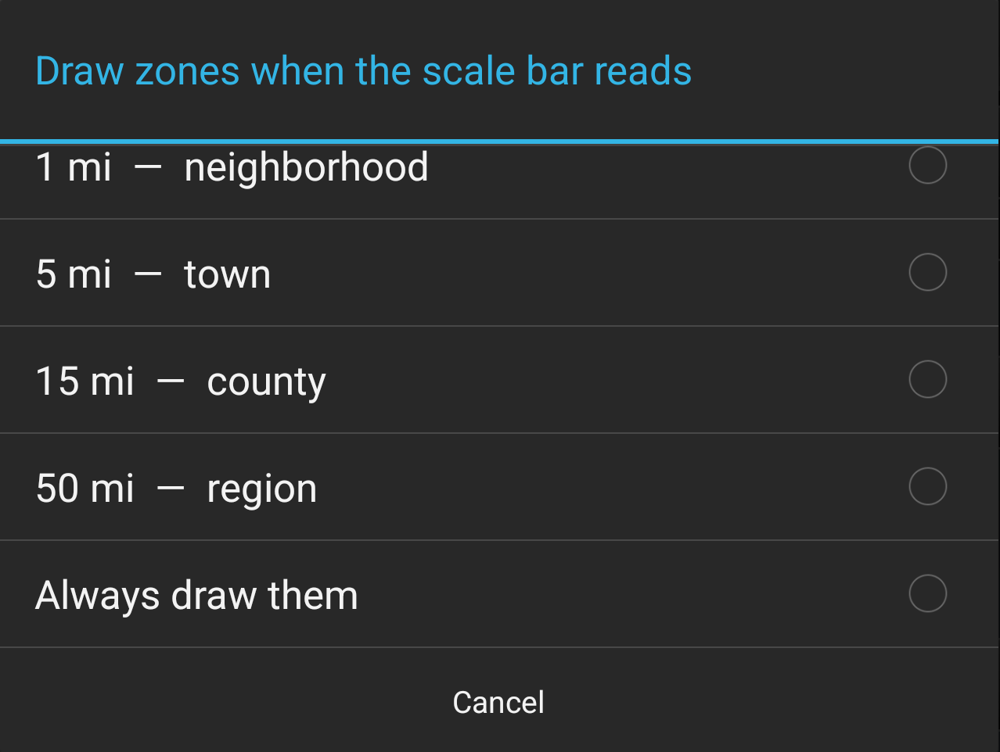

**Presets** are named for what they are for, from a city block to a region.
**Always draw them** turns the threshold off.

## 10. The zone list

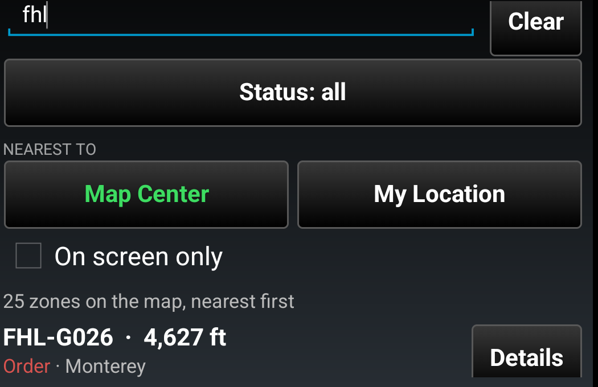

Every zone on the map for this state. Type part of an id, a name or a county to
narrow it; **Clear** empties it. The keyboard covers the
rows while you type; press the phone's Back key once and they show.

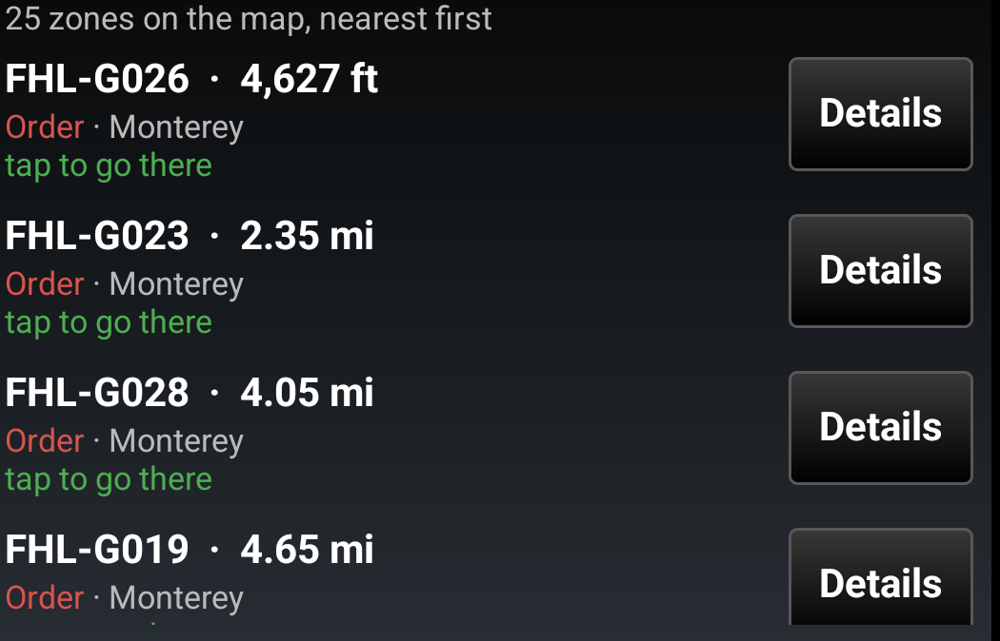

Rows are nearest first, with the distance on each. Tap the row and the map goes
there. **Details** opens the zone's details.

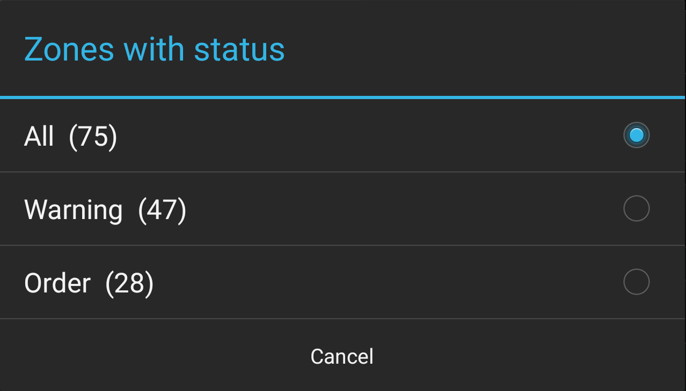

**Status** narrows the list to one status, and each entry carries its count.

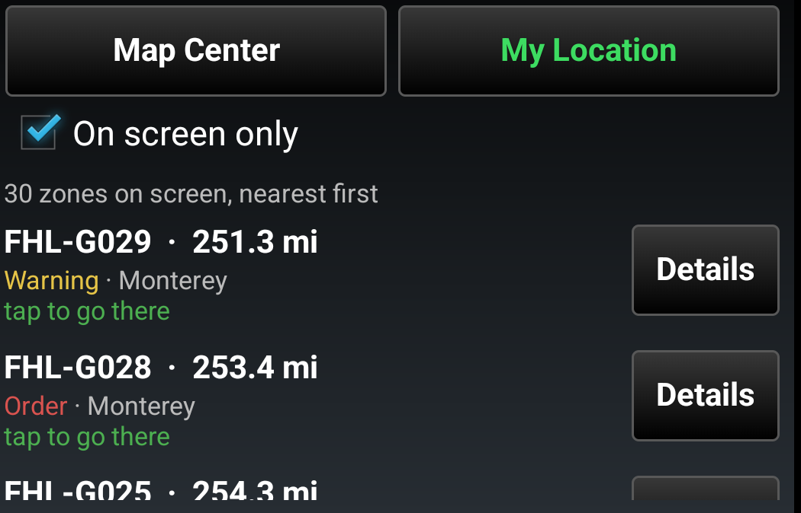

**Nearest to** is where the distances and the radius are measured from: the
map center, or you. **On screen only** keeps the list to what is in the current
map view, and follows the map as you pan.

## 11. If something looks wrong

- "Map is off. Press ON to draw the zones." The big switch is off.
- "Zoom in to see the zones." You are zoomed out past your threshold.
- A row reading **STALE** kept its last fetch after a failed refresh; the reason
  is on the row. The next refresh tries again.
- A state that shows 0 zones between incidents is telling the truth.
- Report a problem at https://github.com/takwerx/evac-zone/issues
